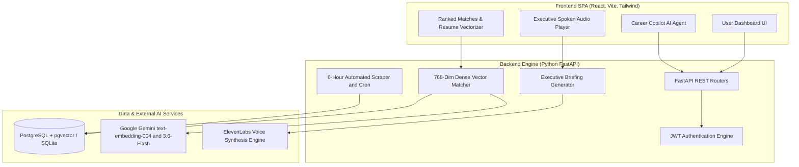
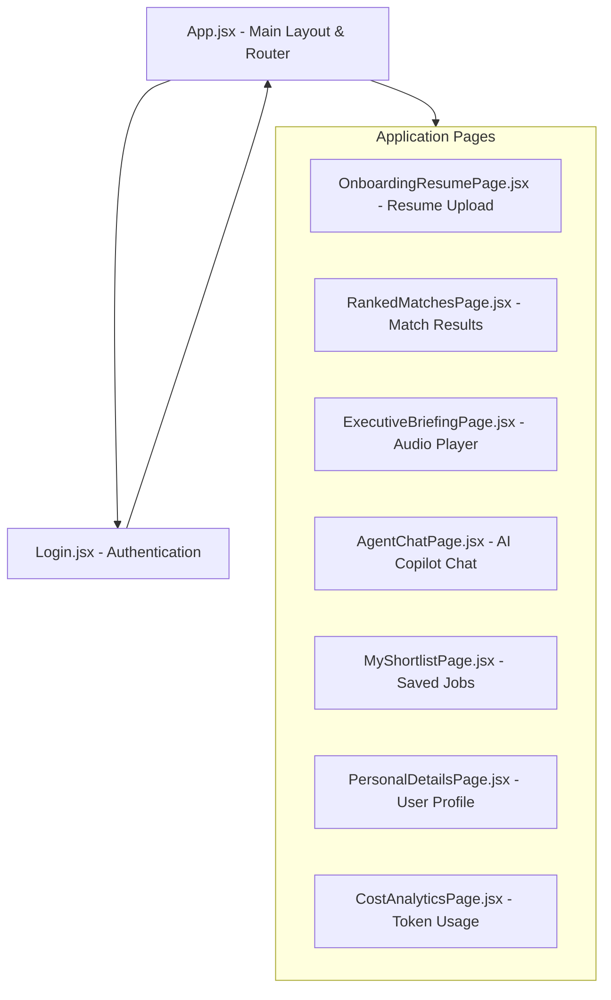

# SAHAAL Career Intelligence Platform

This is my full-stack submission for the Guild Application project. It connects a React + Vite frontend with a FastAPI backend to help job seekers rank opportunities using Gemini embeddings, generate executive spoken audio briefings using ElevenLabs, and chat with an AI career copilot.

## System Architecture

Interactive Flowchart: [View System Architecture Diagram on Mermaid.ai](https://mermaid.ai/d/daf00f8c-c455-4a92-be8f-1630c85ce181)

Note on Video Generation: Video generation API tokens ran out during testing, so I didn't include avatar video generation. Instead, I integrated ElevenLabs voice synthesis to deliver spoken executive audio briefings.

## How to Run Locally

### Backend Setup (b_end)

1. Go to the backend folder:
   cd b_end

2. Set up and activate virtual environment:
   python -m venv .venv
   source .venv/bin/activate  (On Windows: .venv\Scripts\activate)

3. Install required packages:
   pip install -r requirements.txt

4. Start the backend server:
   python start_server.py

The backend will start at http://127.0.0.1:8000 and the health check is available at http://127.0.0.1:8000/health.

### Frontend Setup (f_end)

1. Go to the frontend folder:
   cd f_end

2. Install dependencies:
   npm install

3. Run the development server:
   npm run dev

The frontend will open at http://localhost:5173.

## Live Deployment URLs

* Frontend: Deployed on Railway at https://sahaal-frontend-production.up.railway.app
* Backend: Deployed on Render at https://sahaal-backend-api.onrender.com

## Required Environment Variables

Create a .env file in the b_end directory with these values:

* DATABASE_URL: PostgreSQL connection string with pgvector support. Defaults to local SQLite if not provided.
* JWT_SECRET: Secret key used to sign authentication tokens.
* JWT_ALGORITHM: Algorithm used for JWT signing (default: HS256).
* ACCESS_TOKEN_EXPIRE_MINUTES: Expiration duration in minutes for login tokens (default: 1440).
* GEMINI_API_KEY: Your Google Gemini API key for embeddings and chatbot responses.
* ELEVENLABS_API_KEY: Your ElevenLabs API key for audio briefings.
* ELEVENLABS_VOICE_ID: Voice ID used for generating audio briefings.
* VITE_API_BASE_URL: Frontend environment variable pointing to the backend API URL.

## How Deduplication Works

To stop duplicate job listings from filling up the database during manual scraping or automated 6-hour runs, I built a 3-step deduplication strategy:

1. SHA-256 Payload Hashing: Every scraped job listing gets a 16-character SHA-256 hash generated from its title and company name.
2. Unique URL Constraint: The database table enforces a unique index on source_url so duplicate URLs are skipped automatically.
3. Cosine Distance Matching: When embeddings are generated, listings with a cosine distance under 0.02 compared to existing entries are marked as existing updates rather than new rows.

## Backend Code Structure

Here is how the backend files in b_end are organized and what each part does:

* main.py: Initializes the FastAPI app, configures CORS, mounts the media folder for MP3 audio files, and runs startup database seeding for demo users.
* auth.py: Handles user sign up, login, password hashing with bcrypt, and JWT token verification.
* matches.py: Takes candidate resume text, generates 768-dimensional embeddings using Gemini text-embedding-004, calculates cosine similarity against stored jobs, and ranks top matches.
* audio_briefing.py: Creates market summary text for matched jobs and calls ElevenLabs API to generate MP3 audio files stored in b_end/media.
* chatbot.py: Powers the AI Career Copilot chat page using Gemini 3.6-Flash/1.5-Flash with context about candidate skills and job market data.
* jobs.py: Manages job listing seeding and background job scraping with status polling.
* cost_analytics.py: Tracks token and character usage across Gemini and ElevenLabs calls to calculate API cost estimates.
* database.py: Defines SQLAlchemy database models (User, JobListing, MatchResult, AudioBriefing, TokenLog) and handles fallback from PostgreSQL to SQLite.
* scheduler.py: Runs a background loop every 6 hours to fetch fresh job opportunities automatically.

## Frontend Code Structure & Page Flow

Here is how the React frontend in f_end is set up:

### Main Pages & Components

* App.jsx: The main wrapper component. Checks if a JWT token exists in localStorage, renders the sidebar and top navigation, and switches active pages.
* Login.jsx: Sign in and registration screen with demo login option, form validation, and token storage.
* LoadingScreen.jsx: Simple preloader shown while checking auth state or loading pages.
* OnboardingResumePage.jsx: Onboarding wizard where users set role preferences, target compensation, and paste or upload their resume.
* RankedMatchesPage.jsx: Shows candidate match scores, allows filtering by location/salary, displays matching vs missing skills, and triggers live scraping.
* ExecutiveBriefingPage.jsx: Custom audio player with play/pause, playback speed controls, audio wave visualizer, and live transcript text.
* AgentChatPage.jsx: Interactive AI chat interface for interview practice and resume advice with turn-by-turn token counts.
* CostAnalyticsPage.jsx: Dashboard tracking total session cost in USD and token/character breakdowns for Gemini and ElevenLabs.
* MyShortlistPage.jsx: Saved jobs board where candidates track application stages (Saved, Applied, Interviewing) and add personal notes.
* PersonalDetailsPage.jsx: Profile settings page to update candidate contact information and skill tags.
* Ballpit.jsx & ParticleText.jsx: Canvas components providing particle visual effects for header text and background banners.
* UserProfileDropdown.jsx & CostAnalyticsModal.jsx: Header dropdown for account logout and quick modal view for token costs.

## Honest List of What is Unfinished

Here is a clear and honest list of things that are incomplete or could be improved:

1. WebSockets vs Polling: Background job scraping and audio briefing generation currently rely on short polling endpoints like /jobs/status/{id} instead of real-time WebSockets.
2. Video Generation: My video generation API tokens ran out, so I wasn't able to deliver video avatars. I built ElevenLabs voice briefings instead.
3. Database Migrations: Table creation relies on SQLAlchemy create_all() with fallback logic rather than Alembic migration scripts.
4. User Roles & RBAC: The app supports basic candidate and demo executive accounts, but does not have full multi-tenant team RBAC permissions yet.

---
Submission for SAHAAL Guild Application 2026.
